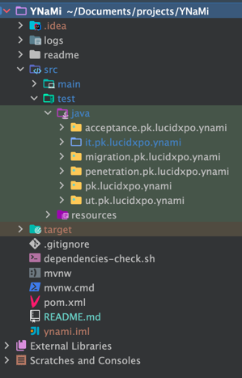

# Why Not Me!!! (YNaMi)

Purpose of this awsomazing project is to have such a template which implements the best software development practices,
and structures the software code in a manner that we can just use this template and start adding out classes in those
locations.

# Testing

Talking about best practices and fear free software development, see how the test package looks like below:



It'll setup the following testing strategies:

* Unit tests using [JUnit 5](https://junit.org/junit5/docs/current/user-guide/)
* Integration tests
* Database migration tests
* Acceptance tests using [cucumber](https://cucumber.io/) and [Selenium](https://www.selenium.dev/)
* Penetration tests using [Zed Attack Proxy (ZAP)](https://www.zaproxy.org/)

#### Running tests from IDE

I guess, since Java 17, we need to add the following to VM options in order to use reflection.

Changes has already been accordingly in the [pom.xml](pom.xml) file, but don't forget to add the following to VM options
if running this application from IDE:

`--add-opens java.base/java.lang=ALL-UNNAMED --add-opens java.base/java.lang.reflect=ALL-UNNAMED`

But since the spring boot upgrade, seems like we don't need to set them in the VM options nor in the
`spring-boot-maven-plugin` in pom.xml file.

And add the following to run the integration tests from the IDE:

```
--add-opens java.base/java.util=ALL-UNNAMED
--add-opens java.base/java.text=ALL-UNNAMED
--add-opens java.base/java.lang=ALL-UNNAMED
--add-opens java.base/java.lang.reflect=ALL-UNNAMED
--add-opens java.desktop/java.awt.font=ALL-UNNAMED
```


## Maven profiles
* There are some profiles setup which can be used switch on/off certain things.
* To see the list of configured profiles, run `mvn help:all-profiles`
    * Configured profiles (in [pom.xml][pom-xml-url] file) are:

      | Profile ID | Profile Description                                          |
      |------------|--------------------------------------------------------------|
      | `ut`       | It'll run only the unit tests                                |
      | `it`       | It'll run only the integration tests                         |
      | `uit`      | It'll run both the unit and the integration tests            |
      | `nt`       | It'll run no tests at all (skipping execution of all tests). |

Learn more about [Maven Profiles][maven-profiles-url]

### Setting up H2

[Click here for the details](readme/H2-SETUP.md)

### Setting up Data Sources in IntelliJ

[Click here for the details](readme/DATA_SOURCES.md)

### Docker Setup (MySQL etc.)

[Click here for the details](readme/DOCKER_SETUP.md)

### Flyway - Database Migrations

[Click here for the details](readme/FLYWAY.md)

### Issues faced during the JAVA upgrade

[Click here for the details](readme/UPGRADE_TO_JAVA20.md)

### Issues faced during the SpringBoot upgrade

[Click here for the details](readme/UPGRADE_SPRINGBOOT_TO_3_1_2.md)

#### Checksums for SQL files

Checksums are used in order to ensure that the SQL db migration scripts are not changed. It's to encourage to write
a new migration script if any more change/update is required instead of touching the existing migration scripts.

To generate checksum for the newly add SQL db migration script, just run the `DBMigrationScriptsChecksumTest` test.
The test will fail printing on the console something like below:

```
*****************************************************************************************
New DB migration/s has/ve been added. The following line/s MUST be added to checksums.txt

V004__create_auditentry_and_auditentryarchive_tables.sql,370a9d48d1ba9fcd47515b6d223727a0

*****************************************************************************************
You MUST add the new checksum/s value/s to the checksums.txt file
*****************************************************************************************
```

Copy the file name along with the checksum from that output and add it to the end of the
[checksums.txt](src/main/resources/db/migration/checksums.txt) file.


<!-- MARKDOWN LINKS & IMAGES -->
<!-- https://www.markdownguide.org/basic-syntax/#reference-style-links -->
[pom-xml-url]:https://github.com/faisalazam/MavenInActionWithGitHubActions/raw/master/TestsExecution/pom.xml
