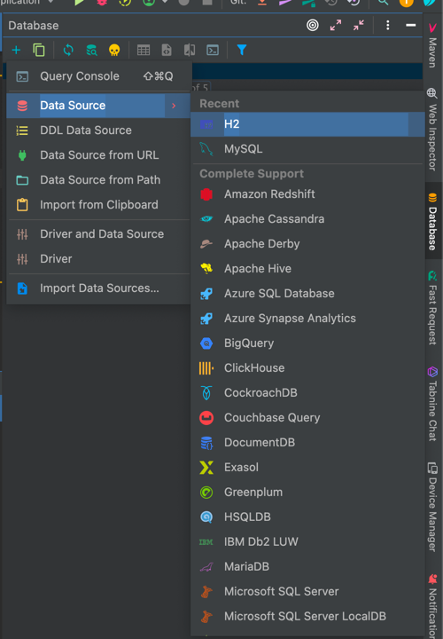
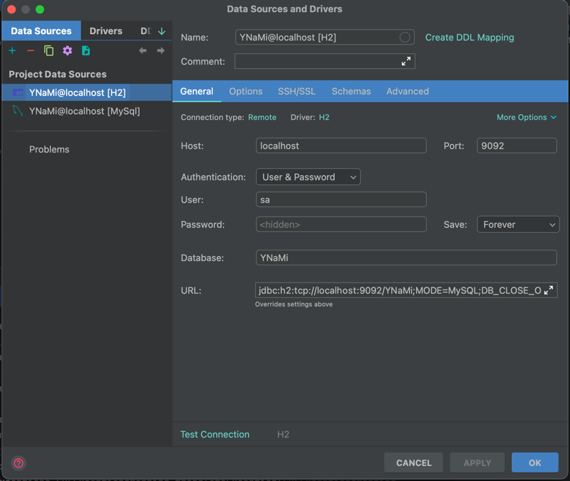
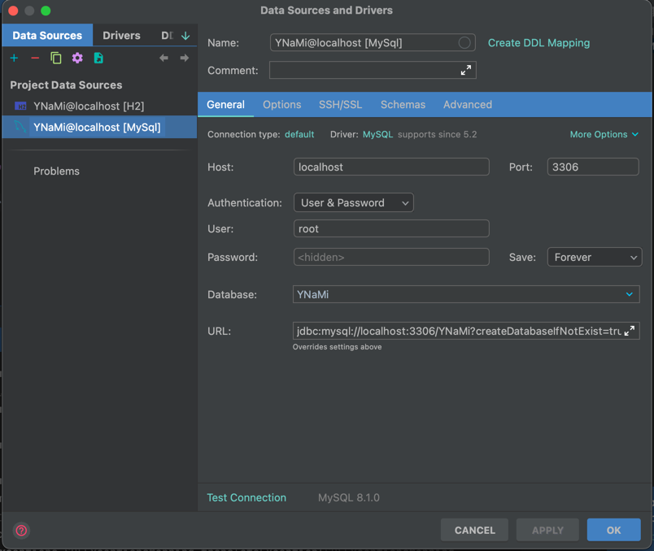

[Go Back](../README.md)

## Add DataSources in IntelliJ

Follow the steps given below from within `IntelliJ`:

* Open the `Database` interface
* Click on `+`
* Click on `Data Source`
* Then click on the data source of your choice

#### H2 DataSource Setup

Setup the `H2` data source something like as shown below:

You'll be able to connect to the `H2` data source once the spring boot application is up and running.

#### MySql DataSource Setup

Setup the `MySql` data source something like as shown below:

In order to be able to connect to the `MySql` data source, you need to have:

* either `MySql` installed and running on some systems
* or `MySql` running in some docker container

[Go Back](../README.md)