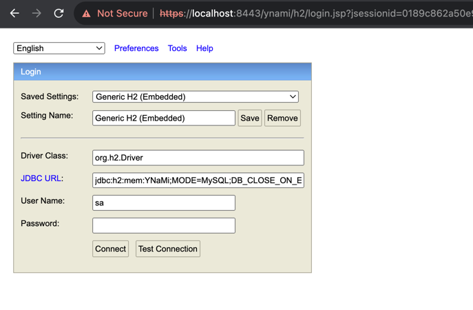
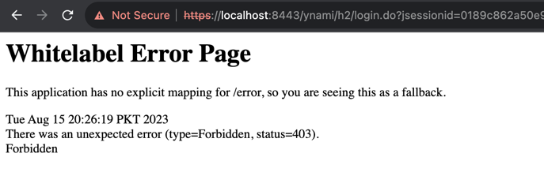
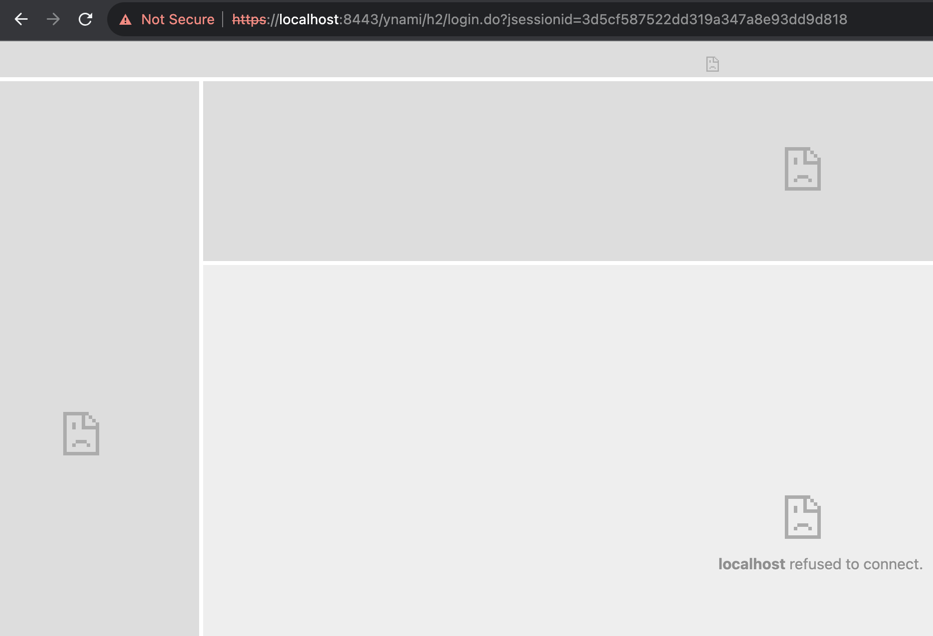

[Go Back](../README.md)

## Upgrade to SpringBoot 3.1.2 from 2.0.5-Release

#### Issues faced during the upgrade

Right after changing the `spring-boot-starter-parent` version from `2.0.5.RELEASE` to `3.1.2` in
the [pom.xml](../pom.xml) file, we're going to face a lot of `cannot find symbol` and `cannot find import` kind of
errors along-with many others.

Following are the details of the issues encountered during the upgrade process

<blockquote>
<details>
    <summary><strong>Click to see details of `Non-resolvable import POM - Selenium`</strong></summary>

### Fatal error compiling: java.lang.ExceptionInInitializerError

[pom.xml](../pom.xml) file started showing errors such as `Non-resolvable import POM after the upgrade`.

<blockquote>
<details>
    <summary><strong>Click here for stacktrace</strong></summary>

```exception
[ERROR] [ERROR] Some problems were encountered while processing the POMs:
[ERROR] Non-resolvable import POM: The following artifacts could not be resolved: 
org.seleniumhq.selenium:selenium-bom:pom:3.14.0 (absent): org.seleniumhq.selenium:selenium-bom:pom:3.14.0 was not 
found in https://repo.maven.apache.org/maven2 during a previous attempt. This failure was cached in the local repository 
and resolution is not reattempted until the update interval of central has elapsed or updates are 
forced @ org.springframework.boot:spring-boot-dependencies:3.1.2, 
~/.m2/repository/org/springframework/boot/spring-boot-dependencies/3.1.2/spring-boot-dependencies-3.1.2.pom, line 2275, column 19
```

</details>
</blockquote>

### Fix

Fix for this problem in my setup/environment was just to update the latest `4.11.0` version for the
`org.seleniumhq.selenium` maven dependencies in the [pom.xml](../pom.xml) file.

</details>
</blockquote>


<blockquote>
<details>
    <summary><strong>Click to see details of `Unresolved dependency`</strong></summary>

### Unresolved dependency

[pom.xml](../pom.xml) file started showing errors such as `Unresolved dependency`.

<blockquote>
<details>
    <summary><strong>Click here for errors</strong></summary>

```errors
'dependencies.dependency.version' for mysql:mysql-connector-java:jar is missing.
'dependencies.dependency.version' for joda-time:joda-time:jar is missing.
Unresolved dependency: 'mysql:mysql-connector-java:jar:unknown'
Unresolved dependency: 'joda-time:joda-time:jar:unknown'
```

</details>
</blockquote>

### Fix

Fix for this problem in my setup/environment was to add the latest `2.12.5` version for the
`joda-time` maven dependency, and to change the `mysql-connector-java` dependency to `mysql-connector-j`
with the latest `8.1.0` version in the [pom.xml](../pom.xml) file.

</details>
</blockquote>

<blockquote>
<details>
    <summary><strong>Click to see details of `Plugin not found`</strong></summary>

### Unresolved dependency

[pom.xml](../pom.xml) file started showing errors such as `Plugin not found`.

<blockquote>
<details>
    <summary><strong>Click here for errors</strong></summary>

```errors
Plugin 'maven-surefire-plugin:2.22.0' not found
Plugin 'org.apache.maven.plugins:maven-project-info-reports-plugin:3.0.0' not found
Plugin 'org.apache.maven.plugins:maven-jxr-plugin:2.5' not found
Plugin 'org.apache.maven.plugins:maven-checkstyle-plugin:3.0.0' not found
Plugin 'org.apache.maven.plugins:maven-surefire-report-plugin:2.22.0' not found
```

</details>
</blockquote>

### Fix

Fix for this problem in my setup/environment was just to add the latest versions for the above-mentioned
maven plugins in the [pom.xml](../pom.xml) file.

</details>
</blockquote>


<blockquote>
<details>
    <summary><strong>Click to see details of `package does not exist`</strong></summary>

### Unresolved dependency

`mvn clean compile` started failing with errors such as `package does not exist`.

<blockquote>
<details>
    <summary><strong>Click here for errors</strong></summary>

```errors
java: package javax.persistence does not exist
java: package javax.servlet.http does not exist
java: package javax.validation.constraints does not exist

java: cannot find symbol
  symbol:   class HttpServletResponse
  
java: cannot find symbol
  symbol: class Entity
  
java: cannot find symbol
  symbol:   class Column
  
etc.
```

</details>
</blockquote>

### Fix

Fix for this problem in my setup/environment was to add the latest `jakarta.validation-api` dependency
in the [pom.xml](../pom.xml) file and migrating the `javax` imports to `jakarta` imports.

</details>
</blockquote>


<blockquote>
<details>
    <summary><strong>Click to see details of `BeanCreationException`</strong></summary>

### Unresolved dependency

`mvn clean compile` started failing with errors such as `Error creating bean with name 'flyway'`.

<blockquote>
<details>
    <summary><strong>Click here for errors</strong></summary>

```exception
org.springframework.beans.factory.BeanCreationException: Error creating bean with name 'flyway' defined in class path 
resource [org/springframework/boot/autoconfigure/flyway/FlywayAutoConfiguration$FlywayConfiguration.class]: 
Unexpected exception during bean creation
	at org.springframework.beans.factory.support.AbstractAutowireCapableBeanFactory.createBean(AbstractAutowireCapableBeanFactory.java:533)
	at org.springframework.beans.factory.support.AbstractBeanFactory.lambda$doGetBean$0(AbstractBeanFactory.java:326)
	at org.springframework.beans.factory.support.DefaultSingletonBeanRegistry.getSingleton(DefaultSingletonBeanRegistry.java:234)
	at org.springframework.beans.factory.support.AbstractBeanFactory.doGetBean(AbstractBeanFactory.java:324)
	at org.springframework.boot.devtools.restart.RestartLauncher.run(RestartLauncher.java:50)
Caused by: java.lang.TypeNotPresentException: Type org.flywaydb.core.api.migration.JavaMigration not present
	at java.base/sun.reflect.generics.factory.CoreReflectionFactory.makeNamedType(CoreReflectionFactory.java:117)
	at java.base/sun.reflect.generics.visitor.Reifier.visitClassTypeSignature(Reifier.java:125)
	at java.base/sun.reflect.generics.tree.ClassTypeSignature.accept(ClassTypeSignature.java:49)
	at java.base/sun.reflect.generics.visitor.Reifier.reifyTypeArguments(Reifier.java:68)
	at java.base/sun.reflect.generics.visitor.Reifier.visitClassTypeSignature(Reifier.java:138)
	... 19 common frames omitted
Caused by: java.lang.ClassNotFoundException: org.flywaydb.core.api.migration.JavaMigration
	at java.base/jdk.internal.loader.BuiltinClassLoader.loadClass(BuiltinClassLoader.java:641)
	at java.base/jdk.internal.loader.ClassLoaders$AppClassLoader.loadClass(ClassLoaders.java:188)
	at java.base/java.lang.ClassLoader.loadClass(ClassLoader.java:521)
	at java.base/java.lang.Class.forName0(Native Method)
	at java.base/java.lang.Class.forName(Class.java:496)
	at java.base/java.lang.Class.forName(Class.java:475)
	at java.base/sun.reflect.generics.factory.CoreReflectionFactory.makeNamedType(CoreReflectionFactory.java:114)
```

</details>
</blockquote>

### Fix

Fix for this problem in my setup/environment was just to update the latest `9.21.0` version for the
`flyway-core` maven dependencies in the [pom.xml](../pom.xml) file.

Also, have to change the way in which `Flyway` is instantiated, from something like this:

```
final Flyway flyway = new Flyway();
flyway.setDataSource(((JdbcTemplate) executor.getTemplate()).getDataSource());
```

to this:

```
final Flyway flyway = configure()
                .dataSource(((JdbcTemplate) executor.getTemplate()).getDataSource())
                .load();
```

</details>
</blockquote>


<blockquote>
<details>
    <summary><strong>Click to see details of `ClassNotFoundException: MySQL5Dialect`</strong></summary>

### Unresolved dependency

`mvn clean compile` started failing with errors such
as `Could not load requested class : org.hibernate.dialect.MySQL5Dialect`.

<blockquote>
<details>
    <summary><strong>Click here for errors</strong></summary>

```exception
org.springframework.beans.factory.BeanCreationException: Error creating bean with name 'entityManagerFactory' 
defined in class path resource [org/springframework/boot/autoconfigure/orm/jpa/HibernateJpaConfiguration.class]: 
Unable to create requested service [org.hibernate.engine.jdbc.env.spi.JdbcEnvironment] due to: Unable to resolve name 
[org.hibernate.dialect.MySQL5Dialect] as strategy [org.hibernate.dialect.Dialect]
	at org.springframework.beans.factory.support.AbstractAutowireCapableBeanFactory.initializeBean(AbstractAutowireCapableBeanFactory.java:1770)
	at org.springframework.beans.factory.support.AbstractAutowireCapableBeanFactory.doCreateBean(AbstractAutowireCapableBeanFactory.java:598)
	at org.springframework.beans.factory.support.AbstractAutowireCapableBeanFactory.createBean(AbstractAutowireCapableBeanFactory.java:520)
	at org.springframework.beans.factory.support.AbstractBeanFactory.lambda$doGetBean$0(AbstractBeanFactory.java:326)
	at java.base/java.lang.reflect.Method.invoke(Method.java:578)
	at org.springframework.boot.devtools.restart.RestartLauncher.run(RestartLauncher.java:50)
Caused by: org.hibernate.service.spi.ServiceException: Unable to create requested service 
[org.hibernate.engine.jdbc.env.spi.JdbcEnvironment] due to: Unable to resolve name 
[org.hibernate.dialect.MySQL5Dialect] as strategy [org.hibernate.dialect.Dialect]
	at org.hibernate.service.internal.AbstractServiceRegistryImpl.createService(AbstractServiceRegistryImpl.java:277)
	at org.hibernate.service.internal.AbstractServiceRegistryImpl.initializeService(AbstractServiceRegistryImpl.java:239)
	... 19 common frames omitted
Caused by: org.hibernate.boot.registry.selector.spi.StrategySelectionException: Unable to resolve name 
[org.hibernate.dialect.MySQL5Dialect] as strategy [org.hibernate.dialect.Dialect]
	at org.hibernate.boot.registry.selector.internal.StrategySelectorImpl.selectStrategyImplementor(StrategySelectorImpl.java:154)
	at org.hibernate.boot.registry.selector.internal.StrategySelectorImpl.resolveStrategy(StrategySelectorImpl.java:236)
	at org.hibernate.boot.registry.selector.internal.StrategySelectorImpl.resolveStrategy(StrategySelectorImpl.java:189)
	at org.hibernate.engine.jdbc.dialect.internal.DialectFactoryImpl.constructDialect(DialectFactoryImpl.java:123)
	... 34 common frames omitted
Caused by: org.hibernate.boot.registry.classloading.spi.ClassLoadingException: Unable to load class [org.hibernate.dialect.MySQL5Dialect]
	at org.hibernate.boot.registry.classloading.internal.ClassLoaderServiceImpl.classForName(ClassLoaderServiceImpl.java:123)
	at org.hibernate.boot.registry.selector.internal.StrategySelectorImpl.selectStrategyImplementor(StrategySelectorImpl.java:150)
	... 42 common frames omitted
Caused by: java.lang.ClassNotFoundException: Could not load requested class : org.hibernate.dialect.MySQL5Dialect
	at org.hibernate.boot.registry.classloading.internal.AggregatedClassLoader.findClass(AggregatedClassLoader.java:215)
	at java.base/java.lang.ClassLoader.loadClass(ClassLoader.java:588)
	at java.base/java.lang.ClassLoader.loadClass(ClassLoader.java:521)
	at java.base/java.lang.Class.forName0(Native Method)
```

</details>
</blockquote>

### Fix

Fix for this problem in my setup/environment was use the follow ing property in the
[application.properties](../src/main/resources/application.properties) file,
i.e. just use `org.hibernate.dialect.MySQLDialect` instead of the missing `org.hibernate.dialect.MySQL5Dialect`
or the `org.hibernate.dialect.MySQL57Dialect` and `org.hibernate.dialect.MySQL8Dialect`, the deprecated ones:

`spring.jpa.properties.hibernate.dialect = org.hibernate.dialect.MySQLDialect`

### New Fix

Although the above-mentioned fix is working but SpringBoot is logging a warning as below:

```
WARN 27688 --- [  restartedMain] org.hibernate.orm.deprecation            : HHH90000025: MySQLDialect does not need to 
be specified explicitly using 'hibernate.dialect' (remove the property setting and it will be selected by default)
[restartedMain] WARN  org.hibernate.orm.deprecation.constructDialect - HHH90000025: MySQLDialect does not need to be 
specified explicitly using 'hibernate.dialect' (remove the property setting and it will be selected by default)
```

So, removing the `hibernate.dialect` from properties files.

</details>
</blockquote>


<blockquote>
<details>
    <summary><strong>Click to see details of `cannot find symbol WebSecurityConfigurerAdapter`</strong></summary>

### Unresolved dependency

`mvn clean compile` started failing with errors such as `cannot find symbol: WebSecurityConfigurerAdapter`.

<blockquote>
<details>
    <summary><strong>Click here for errors</strong></summary>

```errors
java: cannot find symbol
  symbol:   class WebSecurityConfigurerAdapter
  location: package org.springframework.security.config.annotation.web.configuration
```

</details>
</blockquote>

### Fix

Fix for this problem in my setup/environment was to .... WIP

</details>
</blockquote>


<blockquote>
<details>
    <summary><strong>Click to see details of `BeanCreationException: entityManagerFactory`</strong></summary>

### Unresolved dependency

`mvn clean compile` started failing with errors such as `Error creating bean with name 'entityManagerFactory'`.

<blockquote>
<details>
    <summary><strong>Click here for errors</strong></summary>

```exception
org.springframework.beans.factory.BeanCreationException: Error creating bean with name 'entityManagerFactory' 
defined in class path resource [org/springframework/boot/autoconfigure/orm/jpa/HibernateJpaConfiguration.class]: 
net/bytebuddy/NamingStrategy$SuffixingRandom$BaseNameResolver
	at org.springframework.beans.factory.support.AbstractAutowireCapableBeanFactory.initializeBean(AbstractAutowireCapableBeanFactory.java:1770)
	at org.springframework.beans.factory.support.AbstractAutowireCapableBeanFactory.doCreateBean(AbstractAutowireCapableBeanFactory.java:598)
	at org.springframework.beans.factory.support.AbstractAutowireCapableBeanFactory.createBean(AbstractAutowireCapableBeanFactory.java:520)
	at org.springframework.boot.devtools.restart.RestartLauncher.run(RestartLauncher.java:50)
Caused by: java.lang.NoClassDefFoundError: net/bytebuddy/NamingStrategy$SuffixingRandom$BaseNameResolver
	at org.hibernate.bytecode.internal.BytecodeProviderInitiator.buildBytecodeProvider(BytecodeProviderInitiator.java:59)
	at org.hibernate.bytecode.internal.BytecodeProviderInitiator.buildDefaultBytecodeProvider(BytecodeProviderInitiator.java:46)
	... 19 common frames omitted
Caused by: java.lang.ClassNotFoundException: net.bytebuddy.NamingStrategy$SuffixingRandom$BaseNameResolver
	at java.base/jdk.internal.loader.BuiltinClassLoader.loadClass(BuiltinClassLoader.java:641)
	at java.base/jdk.internal.loader.ClassLoaders$AppClassLoader.loadClass(ClassLoaders.java:188)
	at java.base/java.lang.ClassLoader.loadClass(ClassLoader.java:521)
```

</details>
</blockquote>

### Fix

`net.bytebuddy:byte-buddy` maven dependency was added for the test scope in the [pom.xml](../pom.xml) file as part of
the Java 20 upgrade, but that's causing problem after Springboot's upgrade, so solution is just to remove it from the
[pom.xml](../pom.xml) as it'll be loaded by few other dependencies.

</details>
</blockquote>


<blockquote>
<details>
    <summary><strong>Click to see details of `cannot access WrapsElement`</strong></summary>

### Unresolved dependency

`mvn clean compile` started failing with errors such as `cannot access org.openqa.selenium.internal.WrapsElement`.

<blockquote>
<details>
    <summary><strong>Click here for errors</strong></summary>

```error
java: cannot access org.openqa.selenium.internal.WrapsElement
  class file for org.openqa.selenium.internal.WrapsElement not found
```

</details>
</blockquote>

### Fix

Fix for this problem in my setup/environment was just to add the `selenium-common` maven dependencies with
latest `2.0b1` version in the [pom.xml](../pom.xml) file.

```xml

<dependency>
    <groupId>org.seleniumhq.selenium</groupId>
    <artifactId>selenium-common</artifactId>
    <version>2.0b1</version>
</dependency>
```

</details>
</blockquote>


<blockquote>
<details>
    <summary><strong>Click to see details of `Inaccessible H2 Console`</strong></summary>

### Unresolved dependency

After the upgrade, wasn't able to access the `h2-console`, even though everything was properly setup for `h2` in the
[application-h2.properties](../src/main/resources/application-h2.properties) file and `h2` was present in the list of
`spring.profiles.active` in the [application.properties](../src/main/resources/application.properties) file.

`h2` settings configured in my application are:
```properties
# H2
spring.h2.console.enabled=true
spring.h2.console.path=/h2

# Datasource
spring.datasource.url=jdbc:h2:mem:${spring.datasource.name};MODE=MySQL;DB_CLOSE_ON_EXIT=FALSE;DB_CLOSE_DELAY=-1;DATABASE_TO_UPPER=false;
spring.datasource.username=sa
spring.datasource.password=
spring.datasource.driver-class-name=org.h2.Driver
```

<blockquote>
<details>
    <summary><strong>Click here for details</strong></summary>


`h2` is supposed to be accessible at `https://localhost:8443/ynami/h2` in my setup. After hitting this URL, I was getting:




But clicking on `connect` was giving me `Whitelabel Error Page` with `(type=Forbidden, status=403)`



</details>
</blockquote>

### Fix

So, `Spring Security` playing its role and that means that `h2` console should be allowed through `Spring Security`,
and that's how we can fix it:

```java
package pk.lucidxpo.ynami.spring.security;

import org.springframework.beans.factory.annotation.Value;
import org.springframework.context.annotation.Bean;
import org.springframework.context.annotation.Configuration;
import org.springframework.context.annotation.Profile;
import org.springframework.security.config.annotation.web.builders.HttpSecurity;
import org.springframework.security.config.annotation.web.configuration.EnableWebSecurity;
import org.springframework.security.config.annotation.web.configurers.HeadersConfigurer.FrameOptionsConfig;
import org.springframework.security.web.SecurityFilterChain;

import static org.springframework.security.web.util.matcher.AntPathRequestMatcher.antMatcher;

@Profile("h2")
@Configuration
@EnableWebSecurity
public class H2ConsoleSecurityConfig {
    final String h2ConsolePattern;

    public H2ConsoleSecurityConfig(@Value("${spring.h2.console.path:h2-console}") String h2ConsolePath) {
        this.h2ConsolePattern = h2ConsolePath + "/**";
    }

    @Bean
    public SecurityFilterChain h2ConsoleSecurityFilterChain(final HttpSecurity http) throws Exception {
        http
                .authorizeHttpRequests(auth -> auth.requestMatchers(antMatcher(h2ConsolePattern)).permitAll())
                .csrf(csrf -> csrf.ignoringRequestMatchers(antMatcher(h2ConsolePattern)))
                .headers(headers -> headers.frameOptions(FrameOptionsConfig::disable))
        ;
        return http.build();
    }
}
```

The following statement will ensure that you don't see empty frames like below after logging in to `h2` console:

`headers(headers -> headers.frameOptions(HeadersConfigurer.FrameOptionsConfig::disable))`



</details>
</blockquote>


[Go Back](../README.md)
